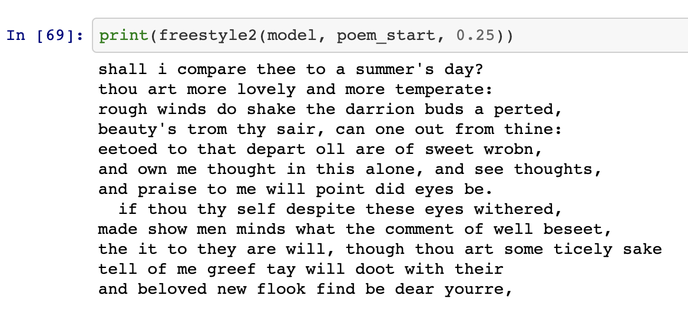

# shakespeare_poem_generator

## Overview
This is a deep learning project of poem generator capable of generating Shakespeare like poems.

## Installation Dependencies:
- Python 3.5 or higher
- PyTorch
- NumPy
- pandas
- torchvision

## Preparation:
```
pip install torch, pandas, numpy, torchvision
git clone https://github.com/ikemenyuki/shakespeare_poem_generator.git
```

Run the .ipynb file on your local conda.

## Mechanisms:
The text data is encoded in one-hot.

The first 40 letters (including space and symbols) are used to predict the next letter, space, or symbol.

This project implements LSTM (Long Short Term Memory) neural networks.

The layer is specified below:
1. a LSTM layer with 2 hidden layers, each with 128 neurons.
2. a dropout layer with p = 0.2.
3. a fully connected layer matches to the prediction outcome.
6. log_softmax activation function.

It is optimized with Adam (A method for stochastic optimization). The loss is measured with NLLLoss.

The model is trained 40 epochs.

## Sample prediction:

